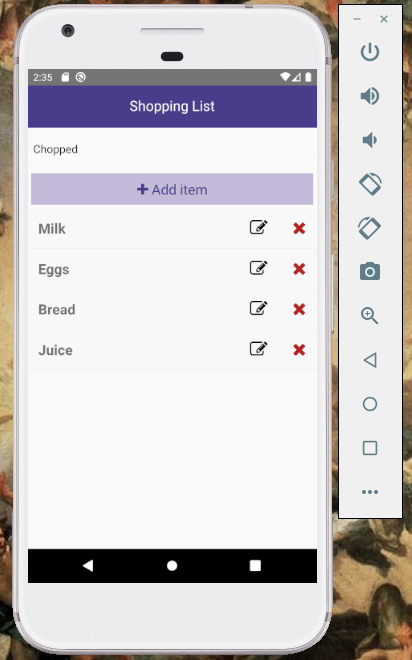
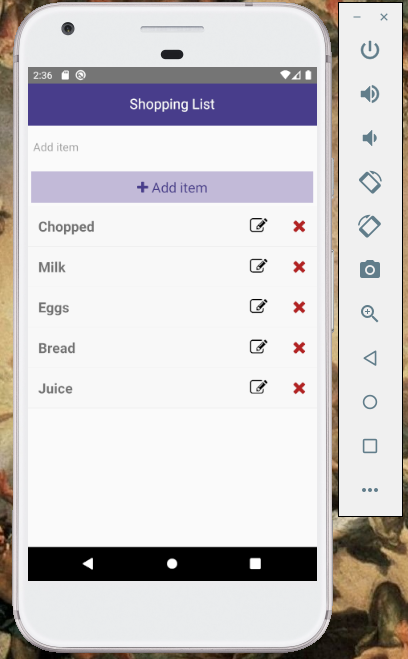
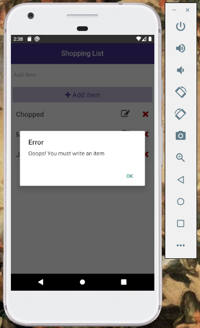
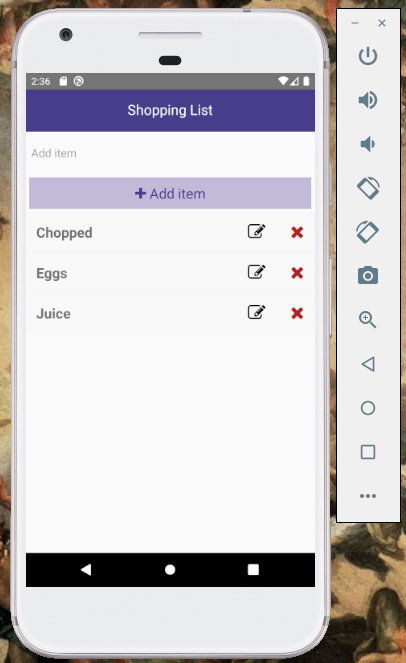
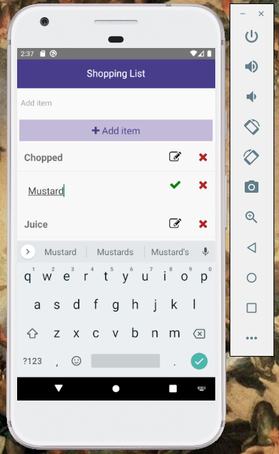
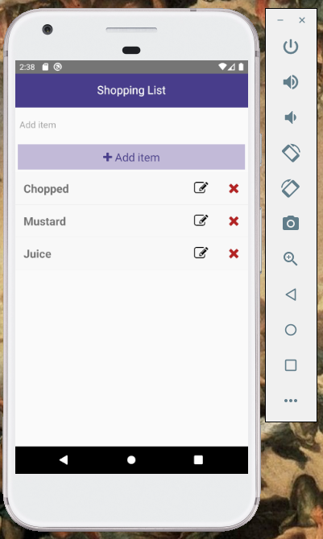
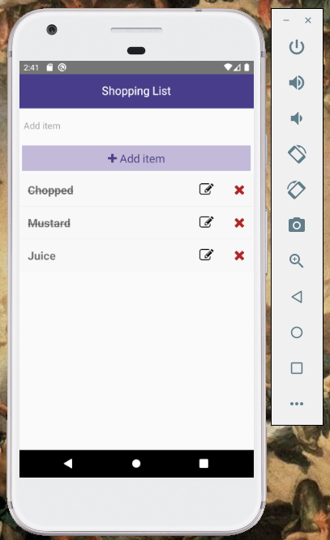

# React Native Shopping List
## How to run the app

**The project needs to have Android Studio or XCode installed!**
**This project was made with Android Studio**
* Download or clone the project into your computer
* Open your Virtual Divice in Android Studio
* Open project in your code editor
* Run command `npm install` to install dependencies
* Start the app opening two terminals.
  * In one terminal run the command `npm start` and in the other run the command `npm run adroid`
* You also can start the app by using only `npm run android`

### Main page

### Add item and message error when input is empty and we click "add Item"
  

### Delete item

### Edit item
 

### Mark item as picked

